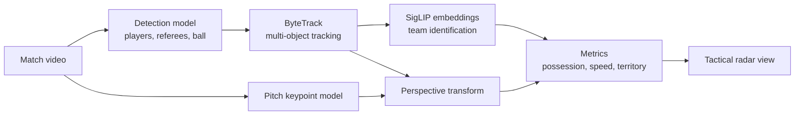

**PlayVision: AI-Powered Player Performance Tracking**, is a next-generation football analytics system that leverages computer vision and machine learning to deliver real-time tactical insights. The project aims to automate player and ball tracking, team identification, and spatial analysis using state-of-the-art frameworks such as YOLOv8, ByteTrack, and SigLIP. Two core models were developed: one for detecting players, referees, and the ball, and another for identifying pitch keypoints to enable perspective transformation and field overlays.

Multi-object tracking was implemented using ByteTrack to maintain continuity in fast-paced scenarios, while embedding techniques like UMAP facilitated positional clustering for tactical role analysis. The system computes key performance metrics such as ball possession, player speed, and territory control in real time, providing a tactical radar view that aids decision-making for coaches, analysts, and fans. Despite challenges like occlusion and latency, PlayVision demonstrates the potential of AI in revolutionizing football strategy, talent scouting, and fan engagement, with future expansions aimed at broader generalization across diverse leagues and match conditions

## What it does

PlayVision automates the parts of match analysis that are usually done by hand:

- **Detects** players, referees and the ball in every frame
- **Tracks** each of them across frames, even in fast play
- **Identifies teams** from how players look, with no manual labelling
- **Maps the pitch** by finding field keypoints and applying a perspective transform
- **Computes metrics**: ball possession, player speed and territory control
- **Shows a tactical radar view**, a top-down map of the match for coaches, analysts and fans

## How it works

**Two models do the vision work.** One detects players, referees and the ball. The other finds keypoints on the pitch (corners, line intersections and so on), which lets us transform camera coordinates into real positions on a flat pitch.

**Tracking keeps identities stable.** ByteTrack follows each object frame to frame, which matters when players cross paths or briefly disappear behind others.

**Team identification uses embeddings.** SigLIP turns each player crop into an embedding so players can be grouped into teams without hand-labelling kits.

**Roles are found by clustering.** UMAP reduces the positional data so players can be clustered into tactical roles.

## Tech stack

Python · YOLOv8 · ByteTrack · SigLIP · UMAP · OpenCV · NumPy · Pandas · PyTorch

## Challenges and limitations

- **Occlusion:** players hidden behind others can cause tracking ID switches.
- **Latency:** running two models plus tracking in real time is demanding, so some optimisation was needed to keep the frame rate up.
- **Generalisation:** the system has been tested on our dataset, and may need retraining for other leagues, camera angles or lighting.

## Future work

- Generalise across different leagues, stadiums and match conditions
- Improve tracking through heavy occlusion
- More metrics for tactical and scouting analysis

